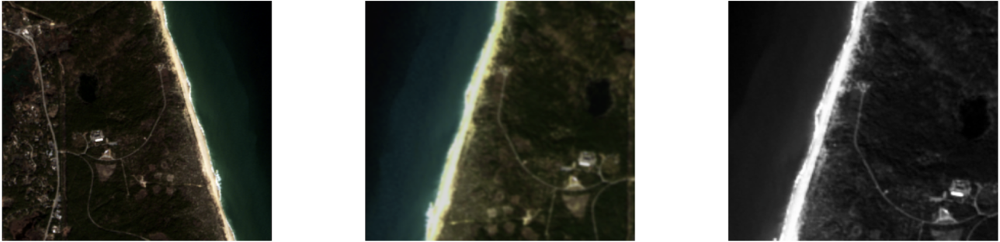
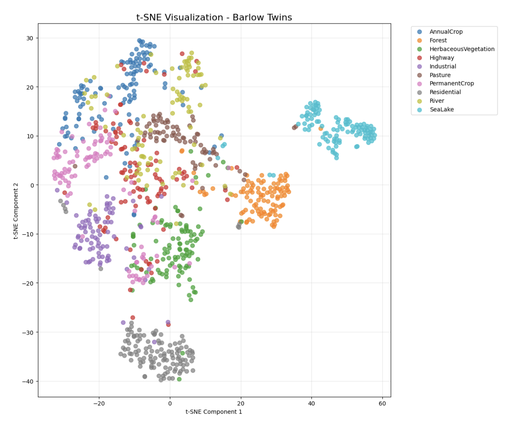

# A Comparative Analysis of Self-Supervised Learning: BYOL vs. Barlow Twins for Earth Observation
A comparative study of BYOL and Barlow Twins for self-supervised representation learning on the SSL4EO-S12 satellite imagery dataset.
 

This repository contains the official PyTorch implementation for the paper: **"A Comparative Analysis of Self-Supervised Learning Models: BYOL and Barlow Twins for Earth Observation with Sentinel Imagery"**.

This project investigates and compares the performance of two leading non-contrastive self-supervised learning (SSL) models, **Bootstrap Your Own Latent (BYOL)** and **Barlow Twins**, for pre-training on satellite imagery. We explore their data efficiency and effectiveness by pre-training on subsets of the **SSL4EO-S12 S2RGB** dataset and evaluating the learned representations on the downstream **EuroSAT** land cover classification task.

---

## Key Findings

Our key finding is a clear, data-dependent trade-off between the two models:

-   🚀 **BYOL** proves to be highly **data-efficient**, achieving strong results even with limited pre-training data.
-   🤔 **Barlow Twins** is **"data-hungry,"** failing with limited data but showing remarkable improvement and achieving state-of-the-art performance when a larger dataset is available.

| Pre-training Data | SSL Method | EuroSAT Accuracy (%) |
| :---------------- | :----------- | :------------------- |
| 12,288 images | BYOL | 79.78% |
| | Barlow Twins | 53.85% |
| 30,720 images | BYOL | 84.39 |
| | Barlow Twins | 77.46% |
| 65,024 images | BYOL | 84.44 |
| |**Barlow Twins** | **88.78%** |

 
*t-SNE visualization showing the feature separability of the models for Barlow Twins model with 65k images.*

---

## Repository Structure
In the Data preparation folder, visualizations were made on how the data was retrieved and what the data looks like. In the Pre-trained folder, separate trainings were conducted for the BYOL and Barlow Twins models on three different datasets (12,288 images, 30,720 images, 65,024 images). Subsequently, these pre-trained models were trained using the linear probing method on the EuroSAT dataset, which contains 27,000 labeled satellite images across 10 classes, and the results were shared in the results section.
